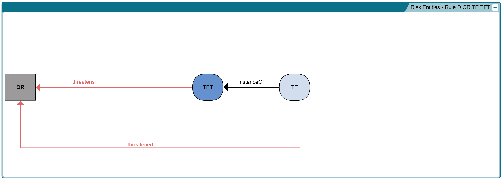

# Risk and Resilience Constraint and Derivation Rules

- [Risk and Resilience Constraint and Derivation Rules](#risk-and-resilience-constraint-and-derivation-rules)
  - [Introduction](#introduction)
    - [Rules Nomenclature](#rules-nomenclature)
  - [Risk Entities](#risk-entities)
    - [Legend](#legend)
    - [Rules for Risk Entities](#rules-for-risk-entities)
      - [Rule R.OR.ORC.ORV](#rule-rororcorv)
      - [Rule D.ORC.ORV.TET](#rule-dorcorvtet)
      - [Rule D.ORC.TE.TET](#rule-dorctetet)
      - [Rule D.OR.ORV.TET](#rule-dororvtet)
      - [Rule D.OR.TE.TET](#rule-dortetet)
      - [Rule R.ORV.TE.TET](#rule-rorvtetet)
      - [Rule D.ORV.TC.TE](#rule-dorvtcte)
      - [Rule D.ORC.ORV.TC](#rule-dorcorvtc)
      - [Rule D.OR.ORC.TC.TO](#rule-dororctcto)
      - [Rule R.ORV.TC.TE.TET](#rule-rorvtctetet)

## Introduction

This document presents the constraint and derivation rules used in ResiliOnt to model risk and resilience entities. Each rule is accompanied by a formal logical expression and a corresponding diagram to illustrate its meaning and relationships. The logical expressions have their mathematical representation provided in LaTeX format.

In the diagrams, **red arrows** represent **derived relations**, which are inferred from other relationships or properties in the model. **Black arrows** represent **regular (non-derived) relations**, which are directly established between entities. The rules are categorized into two main groups: risk entities and resilience entities, each presented with its own set of logical expressions and diagrams.

### Rules Nomenclature

The rules are named according to a specific convention to provide clarity and consistency. The first letter of each rule's name indicates its type:  
- **D** for **Derivation** rules, which define relationships inferred from other properties or rules.  
- **R** for **Restriction** rules, which impose constraints or limitations on possible relations or properties.

Following the type indicator, the rule names include abbreviations of all participating entities. These abbreviations are sorted in alphabetical order and concatenated with dots. For example, the rule "D.OR.ORC.TC.TO" is a derivation rule involving the entities ObjectAtRisk (OR), ObjectAtRisksCapability (ORC), ThreatCapability (TC), and ThreatObject (TO).

Legends explaining the abbreviations used for the entities are provided in the relevant subsections for risk entities and resilience entities. Each subsection details the specific rules applicable to these entities, accompanied by logical formulations and illustrative diagrams.

## Risk Entities' Rules

This section outlines the rules related to **Risk Entities** in the model. Each rule is presented with its corresponding logical expression and visual diagram to illustrate the relationships between different risk entities.

### Legend

The following abbreviations are used to represent different risk entities in the rules:

- **OR**: Object at Risk  
- **ORC**: Object at Risk’s Capability  
- **ORV**: Object at Risk’s Vulnerability  
- **TC**: Threat Capability  
- **TE**: Threat Event  
- **TET**: Threat Event Type  
- **TO**: Threat Object  

These abbreviations will be used consistently throughout the diagrams.

### Rules for Risk Entities

The image below serves as a summary of all the rules that will be detailed in this section. Each subsequent subsection will present a specific rule with its formal logical expression in LaTeX and a focused diagram illustrating only the elements pertinent to that rule.

#### Rule R.OR.ORC.ORV

For any ObjectAtRisksCapability and ObjectAtRisksVulnerability, if the ObjectAtRisksCapability is exposed by the ObjectAtRisksVulnerability, then there is exactly one ObjectAtRisk in which both the ObjectAtRisksCapability and the ObjectAtRisksVulnerability are inherent.

$$
\forall x, y ( ObjectAtRisksCapability(x) \land ObjectAtRisksVulnerability(y) \land exposes(y,x) \rightarrow \exists! z ( ObjectAtRisk(z) \land inheresIn(x,z) \land inheresIn(y,z) ) )
$$

#### Rule D.ORC.ORV.TET

For any ObjectAtRisksVulnerability, ObjectAtRisksCapability, and ThreatEventType, if the ObjectAtRisksVulnerability exposes the ObjectAtRisksCapability and also defines the ThreatEventType, then the ThreatEventType poses a hazard to the ObjectAtRisksCapability.

$$
\forall x, y, z ( ObjectAtRisksVulnerability(x) \land ObjectAtRisksCapability(y) \land ThreatEventType(z) \land exposes(x,y) \land defines(x,z) \rightarrow hazards(z,y) )
$$

#### Rule D.ORC.TE.TET

For any ThreatEvent, ThreatEventType, and ObjectAtRisksCapability, if the ThreatEvent is an instance of the ThreatEventType and the ThreatEventType hazards the ObjectAtRisksCapability, then the ThreatEvent has hazarded the ObjectAtRisksCapability.

$$
\forall x, y, z ( ThreatEvent(x) \land ThreatEventType(y) \land ObjectAtRisksCapability(z) \land instanceOf(x,y) \land hazards(y,z) \rightarrow hazarded(x,z) )
$$

#### Rule D.OR.ORV.TET

For any ObjectAtRisk, ObjectAtRisksVulnerability, and ThreatEventType, if the ObjectAtRisksVulnerability inheres in the ObjectAtRisk and defines the ThreatEventType, then the ThreatEventType threatens the ObjectAtRisk.

$$
\forall x, y, z ( ObjectAtRisk(x) \land ObjectAtRisksVulnerability(y) \land ThreatEventType(z) \land inheresIn(y,x) \land defines(y,z) \rightarrow threatens(z,x) )
$$

#### Rule D.OR.TE.TET

For any ThreatEvent, ThreatEventType, and ObjectAtRisk, if the ThreatEvent is an instance of the ThreatEventType and the ThreatEventType threatens the ObjectAtRisk, then the ThreatEvent has threatened the ObjectAtRisk.

$$
\forall x, y, z ( ThreatEvent(x) \land ThreatEventType(y) \land ObjectAtRisk(z) \land instanceOf(x,y) \land threatens(y,z) \rightarrow threatened(x,z) )
$$

#### Rule R.ORV.TE.TET

For any ObjectAtRisksVulnerability and ThreatEvent, if the ObjectAtRisksVulnerability is manifested in the ThreatEvent, then there exists a ThreatEventType such that the ObjectAtRisksVulnerability defines the ThreatEventType and the ThreatEvent is an instance of the ThreatEventType.

$$
\forall x, y ( ObjectAtRisksVulnerability(x) \land ThreatEvent(y) \land manifestedIn(x,y) \rightarrow \exists z ( ThreatEventType(z) \land defines(x,z) \land instanceOf(y,z) ) )
$$

#### Rule D.ORV.TC.TE

For any ObjectAtRisksVulnerability, ThreatCapability, and ThreatEvent, if the ObjectAtRisksVulnerability and the ThreatCapability are both manifested in the ThreatEvent, then the ThreatCapability exploits the ObjectAtRisksVulnerability.

$$
\forall x, y, z ( ObjectAtRisksVulnerability(x) \land ThreatCapability(y) \land ThreatEvent(z) \land manifestedIn(x,z) \land manifestedIn(y,z) \rightarrow exploits(y,x) )
$$

#### Rule D.ORC.ORV.TC

For any ThreatCapability, ObjectAtRisksVulnerability, and ObjectAtRisksCapability, if the ThreatCapability exploits the ObjectAtRisksVulnerability and the ObjectAtRisksVulnerability exposes the ObjectAtRisksCapability, then the ThreatCapability damages the ObjectAtRisksCapability.

$$
\forall x, y, z ( ThreatCapability(x) \land ObjectAtRisksVulnerability(y) \land ObjectAtRisksCapability(z) \land exploits(x,y) \land exposes(y,z) \rightarrow damages(x,z) )
$$

#### Rule D.OR.ORC.TC.TO

For any ObjectAtRisk, ObjectAtRisksCapability, ThreatObject, and ThreatCapability, if the ObjectAtRisksCapability inheres in the ObjectAtRisk, the ThreatCapability inheres in the ThreatObject, and the ThreatCapability damages the ObjectAtRisksCapability, then the ThreatObject harms the ObjectAtRisk.

$$
\forall x, y, z, k ( ObjectAtRisk(x) \land ObjectAtRisksCapability(y) \land inheresIn(y,x) \land ThreatObject(z) \land ThreatCapability(k) \land inheresIn(k,z) \land damages(k,y) \rightarrow harms(z,x) )
$$

#### Rule R.ORV.TC.TE.TET

For any ThreatCapability and ThreatEvent, if the ThreatCapability is manifested in the ThreatEvent, then there exists an ObjectAtRisksVulnerability and a ThreatEventType such that the ObjectAtRisksVulnerability defines the ThreatEventType, the ThreatEvent is an instance of the ThreatEventType, and the ThreatCapability can exploit the ObjectAtRisksVulnerability.

$$
\forall x, y ( ThreatCapability(x) \land ThreatEvent(y) \land manifestedIn(x,y) \rightarrow \exists z, k ( ObjectAtRisksVulnerability(z) \land ThreatEventType(k) \land defines(z,k) \land instanceOf(y,k) \land canExploit(x,z) ) )
$$

## Resilience Entities' Rules

TBD